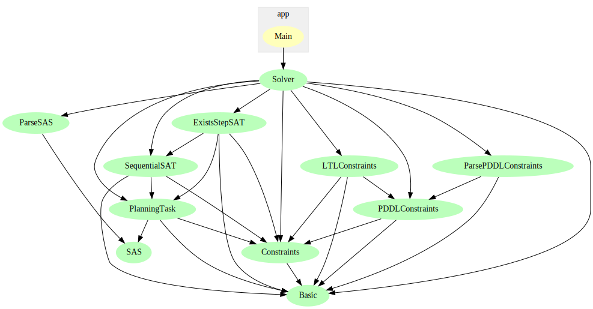

# LTLplanSAT

## Introduction

LTLplanSAT is a SAT-based planner focussed on working with LTL-constraints (or similar formats). The planning problem is expected to be given in pddl format or in sas format, but the latter currently does not support constraints. For pddl a subset of the constraints of pddl3 is suported, namely non-nested constraints without quantifiers (as in the [rovers](examples-PDDL/IPC5-rovers/QualitativePreferences/p01.pddl#L40) problems). More formats should be supported in the future.

LTLplanSAT orignates from a project I (Amos Nicodemus) did in the Master of Logic at the University of Amsterdam, under supervision of Gregor Behnke and Malvin Gattinger.

## Prerequisites
* [Stack](https://docs.haskellstack.org/en/stable/) for compiling and running the project.
* Python should be installed and runnable from the command-line interface (for running Fast Downward).
* The SAT-solver [CryptoMiniSat](https://github.com/msoos/cryptominisat) version 5 needs to be downloaded in an executable called "crytominisat5" (this will usually be the default), and the location of the executables should be added to the path-variables.
* Optionally: The plans generated by the solver can be automatically verified using [VAL](https://github.com/KCL-Planning/VAL) (by using the --VAL flag). To use this option, the binaries of VAL need to be installed in a the directory "Val/bin" within this project.

## Running the project
The project (including the submodule with Fast-Downward) can be cloned, build using the commands
```
git clone --recurse-submodules https://github.com/AmosNico/LTLplanSAT
cd LTLplanSAT
stack build
stack install
```
The command `stack install` puts the executable LTLplanSAT.exe in the root folder of the project. You can then run `LTLplanSAT --help` to get an overview of the available commands.

## Structure of the project.
](dependencies.svg)

TODO: include description of different modules.

## Fast Downward
[Fast Downward](https://github.com/aibasel/downward) (in the submodule [fast-downward](fast-downward)) is used to translate the PDDL domain and problem files into a SAS file. The only changes with respect to the original are:
* The addition of ":constraints" and ":preferences" in the list of allowed requirements (see [here](fast-downward/src/translate/pddl/tasks.py#L77)). 
* The verfication of ":metric" is removed (see [here](fast-downward/src/translate/pddl_parser/parsing_functions.py#L796-L798)), since the addition of ":preferences" broke this test.

## Licence

Because Fast Downward is distributed under the GNU General Public License as published by the Free Software Foundation, this project falls under the same licence.

## References

TODO