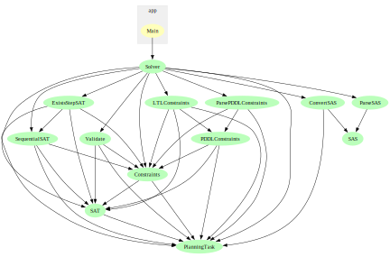

# LTLplanSAT

## Introduction

LTLplanSAT is a SAT-based planner focussed on working with LTL-constraints (or similar formats). The planning problem is expected to be given in pddl format or in sas format, but the latter currently does not support constraints. For pddl a subset of the constraints of pddl3 is suported, namely non-nested constraints without quantifiers (as in the [rovers](examples-PDDL/IPC5-rovers/QualitativePreferences/p01.pddl#L40) problems). More formats should be supported in the future.

LTLplanSAT orignates from a project I (Amos Nicodemus) did in the Master of Logic at the University of Amsterdam, under supervision of Gregor Behnke and Malvin Gattinger.

## Prerequisites
* [Stack](https://docs.haskellstack.org/en/stable/) for compiling and running the project.
* Python should be installed and runnable from the command-line interface (for running Fast Downward).
* The SAT-solver [CryptoMiniSat](https://github.com/msoos/cryptominisat) version 5 needs to be downloaded in an executable called "crytominisat5" (this will usually be the default), and the location of the executables should be added to the path-variables.
* Optionally: The plans generated by the solver can be automatically verified using [VAL](https://github.com/KCL-Planning/VAL) (by using the "--VAL" flag). To use this option, the binaries of VAL need to be installed in a the directory "Val/bin" within this project.

## Running the project
The project (including the submodule with Fast-Downward) can be cloned, build using the commands
```
git clone --recurse-submodules https://github.com/AmosNico/LTLplanSAT
cd LTLplanSAT
stack build
```
After that you can run `stack exec LTLplanSAT -- --help` to get an overview of the available commands. Alternatively, on Windows you can run command `stack install` to build the project and to put the executable LTLplanSAT.exe in the root folder of the project. You can then run `LTLplanSAT --help` to get an overview of the available commands.

## Structure of the project.
](dependencies.svg)

### General working
The module [Main](app/Main.hs) implements a command line interface to interact with the solver. The module [Solver](src/Solver.hs) linkes the different parts of the project together and provides the function `solvePDDL` and `solveSAS` for solving planning problems. These functions call other functions to parse the problem description, handle the constraints, solve the problem and validate it as described below.

### Parsing the problem description
The decription of the planning problem is represented using a type `PlanningTask c` (found in [PlanningTask](src/PlanningTask.hs)), where `c` is the type of the constraints (see below). The function `solvePDDL` (in [Solver](src/Solver.hs)) calls Fast-Downward whichs grounds the planning problem and outputs a SAS-file with the problem description. This SAS-file is then read in [ParseSAS](src/ParseSAS.hs) and converted to a `PlanningTask c` in [ConvertSAS](src/ConvertSAS.hs). The constraints are read separately in [ParsePDDLConstraints](src/ParsePDDLConstraints.hs).

### Constraints
The actual constraints are implemented as `LTLFormula` and `PDDLFormula` (in [LTLConstraints](src/LTLConstraints.hs) and [PDDLConstraints](src/ParsePDDLConstraints.hs)). These constraints are instances of the class `IsConstraint` (in [Constraints](src/Constraints.hs)) which provides all functionallity needed to work with constraints. The module Constraints also provides wrapper types `Constraint a` (consisting of a formula and an identifier for the constraint) and `Constraints a` (collecting different constraints and indicating whether they are hard or soft). Furthermore this module provides functions `selectRandomSoftConstraints` and `selectGivenSoftConstraints` to convert soft constraints to hard constraints. [LTLConstraints](src/LTLConstraints.hs) also provides a function `pddlToLTL` to convert PDDL constraints to LTL.

### Solving the planning problem
In the module [Solver](src/Solver.hs), the SAT solver is iteratively called with increasing bounds for the number of time steps, until either a solution is found or a maximum number of time steps is reached. For each iteration the problem is translated with a sequential or parallel exists-step encoding using the modules [SequentialSAT](src/SequentialSAT.hs) and [ExistsStepSAT](src/ExistsStepSAT.hs). The module [SAT](src/SAT.hs) introduces the most common SAT variables and some helper functions used by these two modules.

### Validation
The function `validatePlan` in the module [Validate](src/Validate.hs) calls VAL and parses it's output to check whether the given plan is valid and whether the select constraints are respected.

## Fast Downward
[Fast Downward](https://github.com/aibasel/downward) (in the submodule [fast-downward](fast-downward)) is used to translate the PDDL domain and problem files into a SAS file. The only changes with respect to the original are:
* The addition of ":constraints" and ":preferences" in the list of allowed requirements (see [here](fast-downward/src/translate/pddl/tasks.py#L77)). 
* The verfication of ":metric" is removed (see [here](fast-downward/src/translate/pddl_parser/parsing_functions.py#L796)), since the addition of ":preferences" broke this test.

## Licence

Because Fast Downward is distributed under the GNU General Public License as published by the Free Software Foundation, this project falls under the same licence. If at some point the project would not use Fast Downward anymore, the licence might be changed to a more permissive open source license.

Copyright 2024 Amos Nicodemus.

## References

1. G. Behnke and S. Biundo, “View of X and more parallelism. Integrating LTL-Next into SAT-based planning with trajectory constraints while allowing for even more parallelism.” doi: [10.4114/intartif.vol21iss62pp75-90](https://doi.org/10.4114/intartif.vol21iss62pp75-90).

2. B. Wright, R. Mattmüller, B. Nebel, and University of Freiburg, “Compiling away soft trajectory constraints in planning,” 2018. [Online]. Available: https://cdn.aaai.org/ocs/18015/18015-78669-1-PB.pdf

3. A. Gerevini, D. Long, University of Brescia, and University of  Strathclyde, “Plan Constraints and Preferences in PDDL3: The language of the Fifth International Planning Competition,” Department of Electronics for Automation, University of Brescia, Italy, Aug. 2005. [Online]. Available: https://www.cs.yale.edu/homes/dvm/papers/pddl-ipc5.pdf

4. “PDDL 3,” Planning.wiki - the AI Planning & PDDL Wiki. https://planning.wiki/ref/pddl3